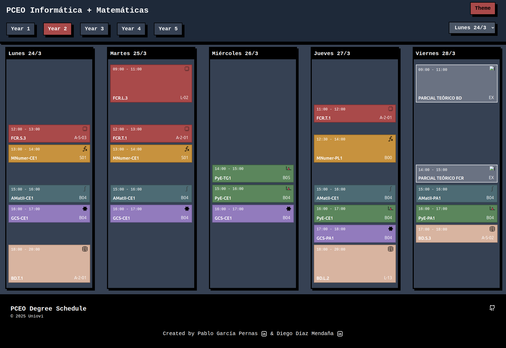

# 🗓️ Horarios PCEO - Frontend Design

Repositorio de la **aplicación web** para visualizar los horarios del doble grado en **Ingeniería Informática + Matemáticas** de Uniovi.

Este proyecto corresponde al frontend de la aplicación, desarrollado con **React**, **TailwindCSS** y desplegado en **Firebase Hosting**.

> 📍 Versión actual:  
> 👉 [https://horariospceo.web.app](https://horariospceo.web.app)

---

## 📸 Vista previa



---

## 🚀 Tecnologías utilizadas

- ⚛️ React (con Vite)
- 🎨 TailwindCSS para los estilos
- 🎥 Framer Motion para animaciones suaves
- 🌐 Firebase Hosting
- 📦 Estructura basada en componentes + modelos de clases (`Course`, `Week`, `Day`, `Subject`)

---

## 📁 Estructura general

```bash

├── dist/
├── docs/
├── public/
    ├── images/
├── src/
    ├── components/
    ├── utils/
    ├── models/
    ├── App.jsx
    ├── index.css
    ├── main.jsx
```

---
## ⚙️ Instalación y uso en local
1. Clonar el repositorio
   ```bash
   git clone https://github.com/PabloGarPe/horarios.git
   cd horarios
   ```
2. Instalar dependencias
    ```bash
    npm install
    ```
3. Ejecutar en desarrollo
    ```
    npm run dev
    ```

---
## Deploy y producción
1. Compilar para producción
    ```bash
    npm run build
    ```
2. Ver preview
    ```bash
    npm run preview
    ```

---
## Documentación adicional
Podrás encontrar más detalles técnicos en la carpeta `docs`:
- `estructura.md`:

---
## Autores
Este proyecto ha sido desarrollado por [@pabloGarPe](https://github.com/PabloGarPe/) y [@Mendana](https://github.com/Mendana/)


Documentación del Backend en su respectivo repositorio
